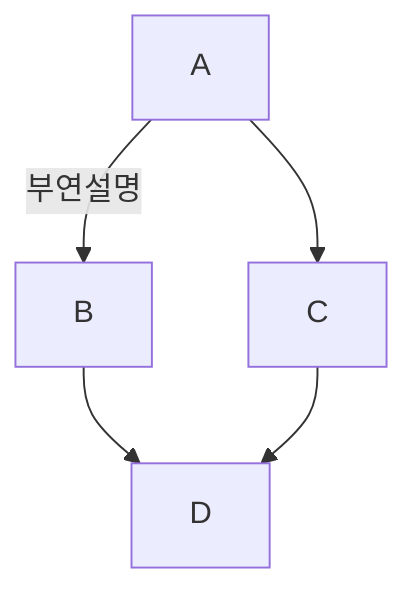
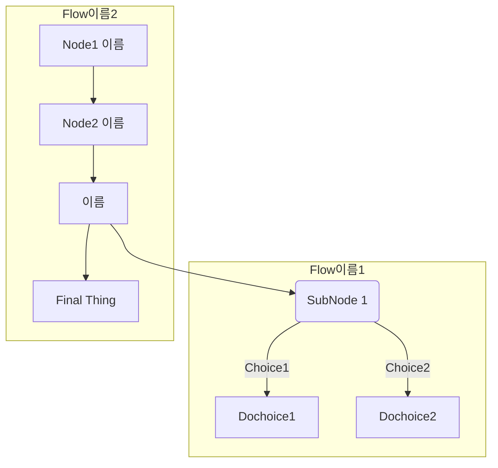

# Markdown_Education


### 목적
-  마크다운 문법을 익히는데 그 목적이 있다.

## MarkDown 교육 과정
- MarkDown
  - [x] MarkDown이란?
  - [x] MarkDown 장단점
- MarkDown 문법
  - [x] 색(Color)
  - [x] 제목(Header)
  - [x] 인용구(BlockQuote)
  - [x] 목록(List)
  - [x] 코드(Code)
  - [x] 링크(Link)
  - [x] 강조(Emphasis)
  - [x] 이미지(Image)
  - [x] 표(Table)
  - [x] 인라인 비교(Inline Diffrent)
  - [x] 세부정보 및 요약(접기)(Details and summary)
  - [x] 수평선(Horizontal Rules)
  - [x] 각주(Footnotes)
  - [x] 체크박스(Task lists)
  - [x] 수학(Math)
  - [x] Mermaid 다이어그램 및 플롯차트(Diagrams and Flowchart)
  - [x] 주석(Remark)
  - [x] 접기
- [x] 마크다운 문법 활용한 문서 만들기


### 수강자
[@gyfolder](https://github.com/gyfolder) [@ttkpark](https://github.com/ttkpark)

### 교육자
[@SAgiKPJH](https://github.com/SAgiKPJH)

## 출처
- MarkDown 참고
  - https://docs.gitlab.com/ee/user/markdown.html
  - https://simhyejin.github.io/2016/06/30/Markdown-syntax/#index
  - https://inasie.github.io/it%EC%9D%BC%EB%B0%98/%EB%A7%88%ED%81%AC%EB%8B%A4%EC%9A%B4-expander-control/
  - https://comeinsidebox.com/markdown/
- 마크다운 정의
  - https://ko.wikipedia.org/wiki/마크다운

<br><br>

# 상세 내용

## 1. MarkDown 이란?
 * MarkDown은 일반 텍스트 기반의 경량 마크업 언어로, 2004년 3월 19일 존그루버와 에런 스워츠에 의해 만들어졌다.
 * HTML과 RTF로 쉽게 변환가능하기에 응용 소프트웨어의 README 파일 또는 온라인 게시물(GitHub)에 사용된다.
 * 문서를 작성하는데 사용하며, 문법이 쉽고 간단하다.

<br><br>

## 2. MarkDown 장단점
### MarkDown 장점
	1. 간결하다.
	2. 별도의 도구없이 쉬운 작성이 가능하다.
	3. 다양한 형태로 변환이 가능하다(HTML, RTF).
	4. 텍스트로 저장되어 용량이 적다.
	5. 텍스트로 저장되어 검색이 쉽다.
	6. 버전 관리시스템을 이용하여 변경 이력을 관리할 수 있다.
	7. 지원하는 프로그램과 플랫폼이 다양하다.
### MarkDown 단점
	1. 표준이 없다.
	2. 표준이 없기 때문에 도구에 따라서 변환 방식이나 생성물이 다르다.
	3. 모든 HTML 마크업을 대신하지 못한다.
	4. 실시간 확인하면서 작업하기에는 약간의 딜레이가 존재한다.

<br><br>

## 3. Markdown Color
```markdown
* `#F00` Red
* `#0F0` Green
* `#00F` Blue
```

* `#F00` Red
* `#0F0` Green
* `#00F` Blue


```markdown
* `#FF0000` Red
* `#0F0A` Green
* `#0000FFAA` Blue
* `RGB(0,0,0)` Black
* `RGB(100%,100%,0%)` Yellow
* `RGB(127,127,50%)` Gray (혼용x)
* `RGB(127,127,127)` Gray 
* `HSL(180,70%,50%)` Cyan
* `HSL(300,70%,50%, 0.5)` 50% Alpha Pink
```
* `#FF0000` Red
* `#0F0A` Green
* `#0000FFAA` Blue
* `RGB(0,0,0)` Black
* `RGB(100%,100%,0%)` Yellow
* `RGB(127,127,50%)` Gray (혼용x)
* `RGB(127,127,127)` Gray 
* `HSL(180,70%,50%)` Cyan
* `HSL(300,70%,50%, 0.5)` 50% Alpha Pink

<br><br>

## 4. Mark Down Header

```markdown
# Heder1
## Heder2
### Heder3 (이후 구분선 없음)
#### Heder4
##### Heder5
###### Heder6
####### Heder7 (7 이후 x)
######## Heder8
## ###### Heder9 (앞 부분만 인식)
### # ## #### Heder10 (앞 부분만 인식)
#Header (잘못된 예시)
```

# Heder1
## Heder2
### Heder3 (이후 구분선 없음)
#### Heder4
##### Heder5
###### Heder6
####### Heder7 (7 이후 x)
######## Heder8 
## ###### Heder9 (앞 부분만 인식)
### # ## #### Heder10 (앞 부분만 인식)
#Header (잘못된 예시)

<br><br>

## 5. MarkDown BlockQuote(인용문)

 "남의 말이나 글에서 직접 또는 간접으로 따온 문장." -국어 사전
```markdown
**한줄인용**
> "남의 말이나 글에서 직접 또는 간접으로 따온 문장." -국어 사전

**여러줄 인용**
>>>
"남의 말이나 글에서 직접 또는 간접으로 따온 문장."(마지막 빈칸2칸 : 들여쓰기)   
 -국어 사전

 \- "남의 말이나 글에서 직접 또는 간접으로 따온 문장."
 \- _(-국어 사전)_(마지막 빈칸2칸 : 들여쓰기)   
 \- _(-국어 사전)_
>>>

> 남의 말이나 글에서 직접 또는 간접으로 따온 문장."
> -국어 사전(마지막 빈칸2칸 : 들여쓰기)  
> -국어 사전
```
### 한줄 인용구

> "남의 말이나 글에서 직접 또는 간접으로 따온 문장." -국어 사전

### 여러줄 인용구
>>>
"남의 말이나 글에서 직접 또는 간접으로 따온 문장."(마지막 빈칸2칸 : 들여쓰기)  
 -국어 사전

 \- "남의 말이나 글에서 직접 또는 간접으로 따온 문장."
 \- _(-국어 사전)_(마지막 빈칸2칸 : 들여쓰기)  
 \- _(-국어 사전)_
>>>
 
> 남의 말이나 글에서 직접 또는 간접으로 따온 문장."
> -국어 사전(마지막 빈칸2칸 : 들여쓰기)  
> -국어 사전

```markdown
**중첩 인용**
> 중첩1

>> 중첩2


>>> 중첩3 - 1
>>> 중첩3 - 2
내용
>>>> 중첩4
>>>>> 중첩5
>>>>>>> 중첩7 (연속중첩)
>>> 중첩3 (중첩 안됨)
```
### 중첩 인용
> 중첩1

>> 중첩2


>>> 중첩3 - 1
>>> 중첩3 - 2
내용
>>>> 중첩4
>>>>> 중첩5
>>>>>>> 중첩7 (연속중첩)
>>> 중첩3 (중첩 안됨)

<br><br>

## 6. MarkDown List

### 순서가 있는 리스트 (코드)
```markdown
1. 1번째 리스트
   - 1-1번째 소항목
   - 1-2번째 소항목
2. 2번째 리스트
3. 3번째 리스트
   - 3-1번째 소항목
   - 3-2번째 소항목
7. 7번재 리스트 (숫자 내림차순으로 강제 부여)
5. 5번재 리스트
  1. (부여x)
  2. (부여x)
```
### 순서가 있는 리스트 (실행)
1. 1번째 리스트
   - 1-1번째 소항목
   - 1-2번째 소항목
2. 2번째 리스트
3. 3번째 리스트
   - 3-1번째 소항목
   - 3-2번째 소항목
7. 7번재 리스트 (숫자 내림차순으로 강제 부여)
5. 5번재 리스트
  1. (부여x)
  2. (부여x)

<br>

### 순서가 없는 리스트 (코드)
```markdown
- 리스트 1
   - 리스트 1-1
   - 리스트 1-2
      - 리스트 1-2-1
      - 리스트 1-2-2
         -리스트 1-2-2-1 (리스트 해당 안됨)
- 리스트 2
* 리스트 3
   + 리스트 3-1
      - 리스트 3-1-1 (-, *, + 기호에 무관하게 부여)

리스트 중간부터 시작
1. 리스트
    - 리스트 (중)
```
### 순서가 없는 리스트 (실행)
- 리스트 1
   - 리스트 1-1
   - 리스트 1-2
      - 리스트 1-2-1
      - 리스트 1-2-2
         -리스트 1-2-2-1 (리스트 해당 안됨)
- 리스트 2
* 리스트 3
   + 리스트 3-1
      - 리스트 3-1-1 (-, *, + 기호에 무관하게 부여)  

리스트 중간부터 시작
1. 리스트
    - 리스트 (중)

<br><br>

## 7. MarkDown Code

### 코드 블럭 (코드)
```markdown
`std::cout << "hello";`공백 2개 : 들여쓰기)  
`int a = 0;`
`int b = 0;`
```cs
int main(){
 std::cout << "hello";
 int a = 0;
 return 0;
}
"```"

```
### 코드 블럭 (실행)
`std::cout << "hello";`  (공백 2개 : 들여쓰기)  
`int a = 0;`
`int b = 0;`
```cs
int main(){
 std::cout << "hello";
 int a = 0;
 return 0;
}
```

### 코드별 언어 설정
|언어|MarkDown|언어|MarkDown|
|---|---|---|---|
|Bash|bash|JSON|json|
|C#|cs|Java|java|
|C++|cpp|JavaScript|javascript|
|CSS|css|PHP|php|
|Diff|diff|Perl|perl|
|HTML/XML|html|Python|python|
|HTTP|http|Ruby|ruby|
|Ini|ini|SQL|sql|


<br><br>

## 8. MarkDown Link

### 링크 삽입 (코드)
링크 삽입 시 문법 : \[주소에 대한 설명] \[참조번호]
참조 번호 작성 문법 : \[참조 번호]: 주소
```markdown
http://www.google.co.kr/  
<http://www.google.co.kr/>


 [주소에 대한 설명](http://www.google.co.kr/)  
 [주소에 대한 설명](http://www.google.co.kr/ "마우스ON > 설명추가")  


 이 부분은 [google][1]를 참고하시면 됩니다. 아래 사진은 사진링크입니다.  
[][1]
  
 [1]: http://www.google.co.kr/  


```
### 링크 삽입 (실행)
http://www.google.co.kr/  
<http://www.google.co.kr/>


 [주소에 대한 설명](http://www.google.co.kr/)  
 [주소에 대한 설명](http://www.google.co.kr/ "마우스ON > 설명추가")  


 이 부분은 [google][1]를 참고하시면 됩니다. 아래 사진은 사진링크입니다.  
[][1]
  
 [1]: http://www.google.co.kr/  

 
 
<br><br>

## 9. MakrDown Emphasis

### 강조 (코드)
```markdown
*기울림꼴 italic*  
_기울림꼴 italic(단축키 'Ctrl' + '-')_  
<em>italic text</em>

**굵게(단축키 'Ctrl' + '*')**  
__굵게__  
<strong>bold text</strong>  

***굵게+기울림***  
___굵게+기울림___  

~~취소선~~  

~~**굵게+취소선**~~  
**~~굵게+취소선~~**  
~~__굵게+취소선__~~  
__~~굵게+취소선~~__  
```
### 강조 (실행)

*기울림꼴 italic*  
_기울림꼴 italic(단축키 'Ctrl' + '-')_  
<em>italic text</em>

**굵게(단축키 'Ctrl' + '*')**  
__굵게__  
<strong>bold text</strong>  

***굵게+기울림***  
___굵게+기울림___  

~~취소선~~  

~~**굵게+취소선**~~  
**~~굵게+취소선~~**  
~~__굵게+취소선__~~  
__~~굵게+취소선~~__  


<br><br>

## 10. MarkDown Image

### 이미지 (코드)
```markdown
    
  
  
  
  
```
### 이미지 (실행)

    
  
  
  
  


<br><br>

## 11. MarkDown Table

### 테이블 (코드)
```markdown
|제목1|왼쪽정렬|중앙정렬|오른쪽정렬|
|-----|:-------|:------:|---------:|  (-개수 무관)
|     |    2   | **3**  |   4      |  (공란 생략)
|1    |        | 3      |         4|
|    1|  _2_   |        | 4        |
|1<br>다음 줄|2|~~3~~| |

```
### 테이블 (실행)
|제목1|왼쪽정렬|중앙정렬|오른쪽정렬|
|-----|:-------|:------:|---------:|  
|     |    2   | **3**  |   4      |  (공란 생략)
|1    |        | 3      |         4|
|    1|  _2_   |        | 4        |
|1<br>다음 줄|2|~~3~~| |


<br><br>

## 12. MarkDown Inline Diffrent

### 내용 (코드)
```markdown
`인라인`  
<code>inline</code>  
{-addition-}  
{+deletion+}  
[-addition-]  
[+deletion+]  
[+내용 \`인라인\` +]

```
### 내용 (실행)

`인라인`  
<code>inline</code>  
{-addition-}  
{+deletion+}  
[-addition-]  
[+deletion+]  
[+내용 \`인라인\` +]


<br><br>

## 13. MarkDown Details and Summary

## 세부정보 요약 접기 (코드)
```markdown
<details>
<summary>접기/펼치기 버튼</summary>
 div markdown="1"은 jekyll에서 html사이에 markdown을 인식하기 위한 조치
<div markdown="1">
```
### 내용 (실행)

<details>
<summary>접기/펼치기 버튼</summary>
 div markdown="1"은 jekyll에서 html사이에 markdown을 인식하기 위한 조치
<div markdown="1">
<br>


<br><br>

## 14. MarkDown Horizontal Rules

### 내용 (코드)
```markdown
(Header로 인식할 수 있기 때문에 이전 라인은 비워두어야 한다)

---
내용
***
내용
___
```
### 내용 (실행)
(Header로 인식할 수 있기 때문에 이전 라인은 비워두어야 한다)

---
내용
***
내용
___


<br><br>

## 15. MarkDown Footnotes
Footnotes는 GitHub에선 동작하지 않는다.
### 각주 (코드)
```markdown
각주입니다[^id]  
각주2입니다[^sd]  

[^id]:각주에 대한 설명  
[^sd]:각주2에 대한 설명  
```
### 각주 (실행)
각주입니다[^id]  
각주2입니다[^sd]  

[^id]:각주에 대한 설명  
[^sd]:각주2에 대한 설명  


<br><br>

## 16. MarkDown Task Lists

### 내용 (코드)
```markdown
 - [ ] task1
 - [x] task2
 - [ ] task3
   - [ ] task3-1
   - [x] task3-2
1. [ ] task1
2. [x] taks2 
```
### 내용 (실행)
 - [ ] task1
 - [x] task2
 - [ ] task3
   - [ ] task3-1
   - [x] task3-2
1. [ ] task1
2. [x] taks2 


<br><br>

## 17. MarkDown Math

### 수학식 (코드)
```markdown
$`a^2+b^2=c^2`$
```math
a^2+b^2=c^2
"```"
```
### 수학식 (실행)
$`a^2+b^2=c^2`$
```math
a^2+b^2=c^2
```


<br><br>

## 18. MarkDown Diagram and Flowchart
### Diagram and Flowchart (코드)
```markdown
```mermaid
graph TD;
  A--부연설명-->B;
  A-->C;
  B-->D;
  C-->D;
"```"

```mermaid
graph TB
  SubGraph1 --> SubGraph1Flow
  subgraph "Flow이름1"
  SubGraph1Flow(SubNode 1)
  SubGraph1Flow -- Choice1 --> Dochoice1
  SubGraph1Flow -- Choice2 --> Dochoice2
  end

  subgraph "Flow이름2"
  Node1[Node1 이름] --> Node2[Node2 이름]
  Node2 --> SubGraph1[이름]
  SubGraph1 --> FinalThing[Final Thing]
end
"```"
```
### Diagram and Flowchart(실행)



<br>

[Mermaid Guide](https://mermaid-js.github.io/mermaid/#/)


<br><br>

## 19. MarkDown Remark

### 주석 (코드)
```markdown
내용 <!--주석처리-->  
긴 내용 <!--
긴 주석
-->
```
### 주석 (실행)

내용 <!--주석처리-->  
긴 내용 <!--
긴 주석
-->

<br>

